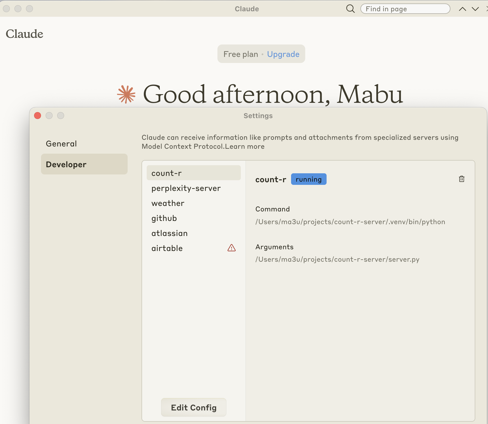
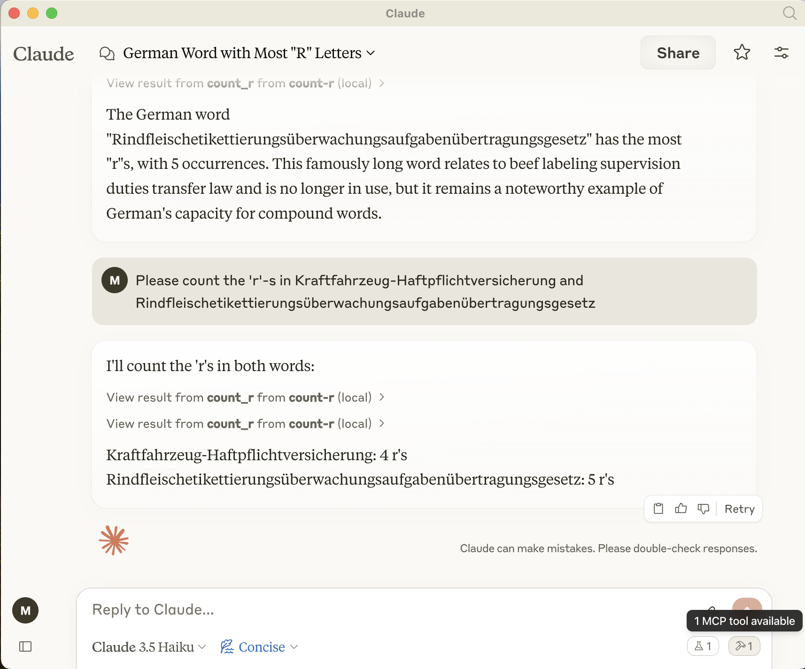
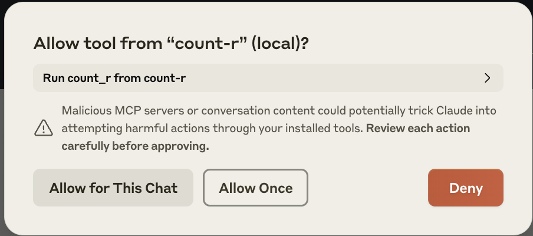

# Create your first own server

## Linux

```bash
python3 -m venv .venv
source .venv/bin/activate
pip install mcp
touch server.py
```

## More MCP servers and clients

- on Github <https://github.com/appcypher/awesome-mcp-servers>

## Setup of Claude Desktop

1. Install [Claude Desktop](https://github.com/appcypher/Claude/releases/latest/download/)

2. Open Claude Desktop

3. Add a new mcp server with Apple Key + , change to tab developer and open

4. Add a new mcp server to claude_desktop_config.json

```json
{
  "mcpServers": {
    "count-r": {
      "command": "/Users/ma3u/projects/mcp-server-count-r-/.venv/bin/python",
      "args": [
        "/Users/ma3u/projects/mcp-server-count-r-/server.py"
      ],
      "host": "127.0.0.1",
      "port": 5000,
      "timeout": 10000
    }
  }
}
```

5. Restart Claude Desktop

6. Test with Claude Desktop and the nice german word: Rindfleischetikettierungsüberwachungsaufgabenübertragungsgesetz



7. Accept the new mcp server



8.Check logs of Claude Desktop:

```bash
tail -n 20 -F ~/Library/Logs/Claude/mcp*.log | grep "count-r"

```
